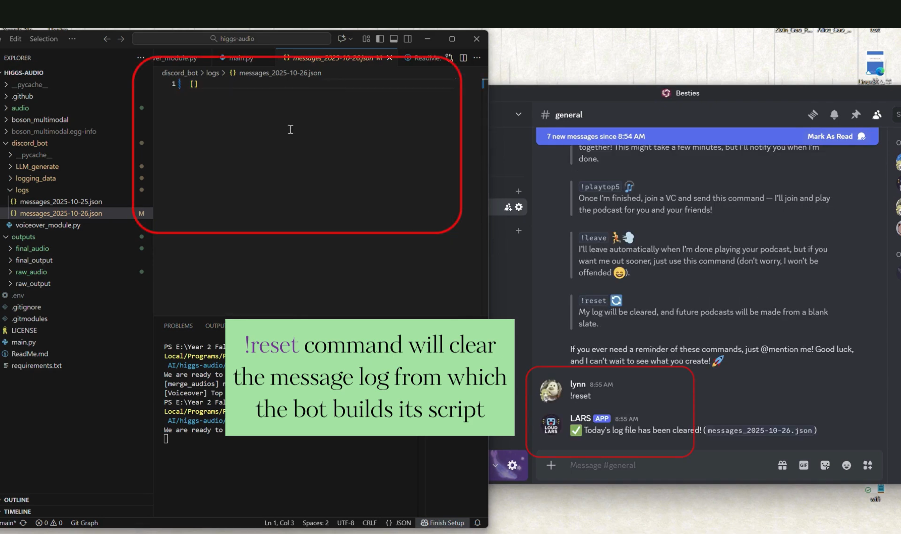
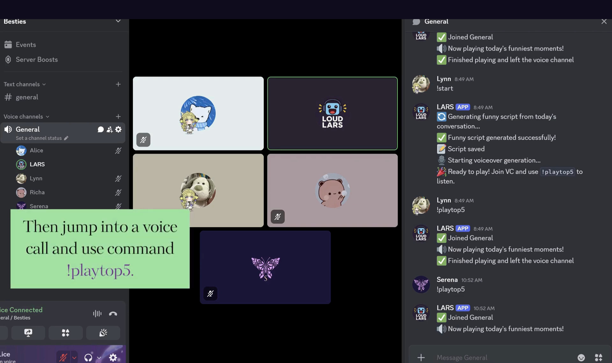
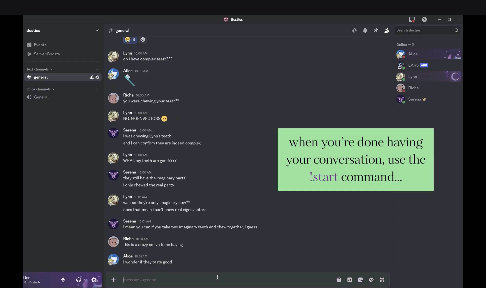

# 💥Welcome to LoudLARS! 

LoudLARS is a Discord bot that generates a podcast about the top five moments of your Discord server chat and reads it out to you in your **OWN VOICE**!! _#mindblown_ 🤯

### 💡Inspiration
LARS was made by a group of friends with our fair share of humour, usually IRL, but occasionally through our Discord server chat. We thought it might be fun to create something to commemorate some of our favourite and funniest moments, in the style of [Spotify Wrapped](https://www.spotify.com/us/wrapped/).

### ℹ️ How it works
Once LARS is on a Discord server, it'll start logging the day's messages in a JSON file. Once the ``!start`` command is passed, the JSON log will be sent to an LLM, which will read the messages, pick out the funniest moments, and write a little podcast script, in the style of the ever-famous [Top Ten videos](https://youtu.be/MAfIvBgChjQ?si=BHD_1n95lZDMAoMz) of our youth. 

Then, the script is given to [Boson AI's Higgs Audio's](https://github.com/boson-ai/higgs-audio) text-to-speech function. It simulates emotions from the text as well, giving the podcast a witty (😉) and polished sound. And the best part? Our messages are read in our own voices, synthesized from short clips we uploaded to the program. (Our own voices aren't included here--but someone can add a sample of their voice as a .wav file in.)

### ✏️ Skills
We learned a lot throughout this project! None of us had ever developed a Discord bot before. We integrated an LLM (ft: quite a bit of prompt engineering), and learned how to generate audio, listen and interpret speech, and adjust emotional cues.

### 🤔 What's Next?
We had an incredible time working together on LARS. Next steps might include giving the user more control over the podcast settings (i.e., top ten of the year instead of top five of the day), further training the LLM model to recognize what constitutes online chat humour, or perhaps switching out narrator and user voices (Shrek podcast, anyone? 😅). 

### 🙏 Acknowledgements
Many thanks to the Boson AI team for giving us this opportunity to use their awesome open-source model and for this whole hackathon, and especially to our instructor [Murdock Aubry](https://murdockaubry.com/) for encouraging us to join and for his support along the way.

# 🔗 Video demo

▶️ https://youtu.be/pQ3ZEhj0Lqc?si=pvyMVHSEgPmaUKkl

# Screenshots

