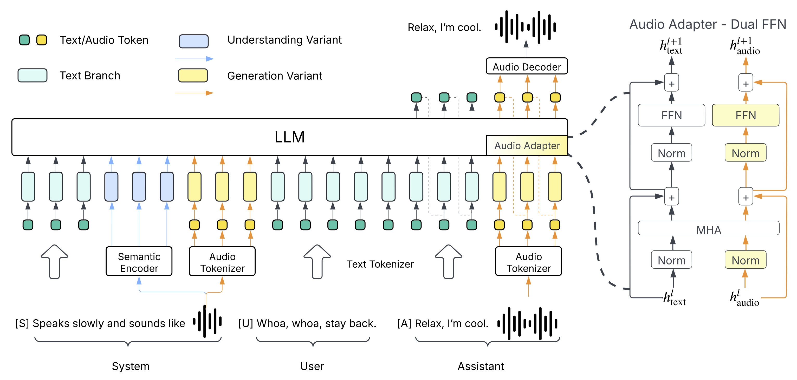
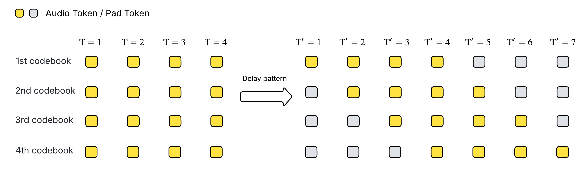
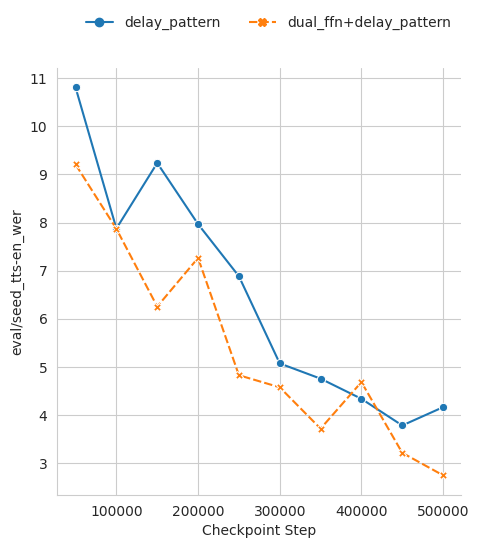
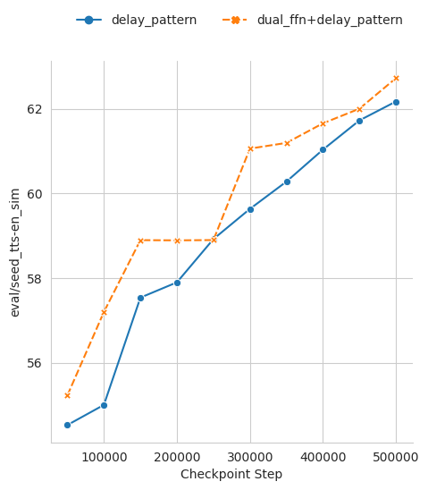
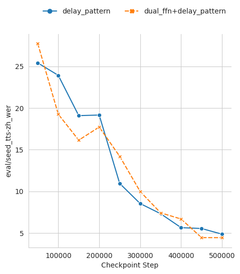
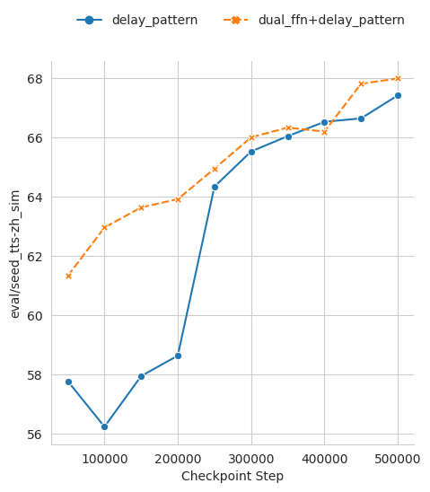

# HiggsAudio-V2 Model Architecture

Our model is built on top of [Llama-3.2-3B](https://huggingface.co/meta-llama/Llama-3.2-3B). To enhance the model’s ability to process audio tokens, we incorporate the "DualFFN" architecture as an audio adapter. DualFFN acts as an audio-specific expert, boosting the LLM's performance with minimal computational overhead. Our implementation preserves 91% of the original LLM’s training speed with the inclusion of DualFFN.

Since our audio tokenizer is based on Residual Vector-Quantization (RVQ) and contains multiple codebooks, we adopt the [delay pattern](https://proceedings.neurips.cc/paper_files/paper/2023/file/94b472a1842cd7c56dcb125fb2765fbd-Paper-Conference.pdf) to enable simultaneous code generation across codebooks while supporting streaming.

## DualFFN Performance Ablation Study

To assess the effectiveness of DualFFN, we trained two smaller models based on LLaMA-3.1-1B: one incorporating DualFFN and one without. Both models were trained for 250K steps with a learning rate of 5e-4 on a subset of the AudioVerse dataset. We evaluated their performance on SeedTTS-Eval, with the results presented in the figures below. The model equipped with DualFFN consistently outperforms its counterpart in terms of word error rate (WER) and speaker similarity.

- SeedTTS-EN

 

- SeedTTS-ZH

 

We may notice that the model with DualFFN consistently outperforms the model without DualFFN in terms of word-error-rate (WER) and speaker similarity.
